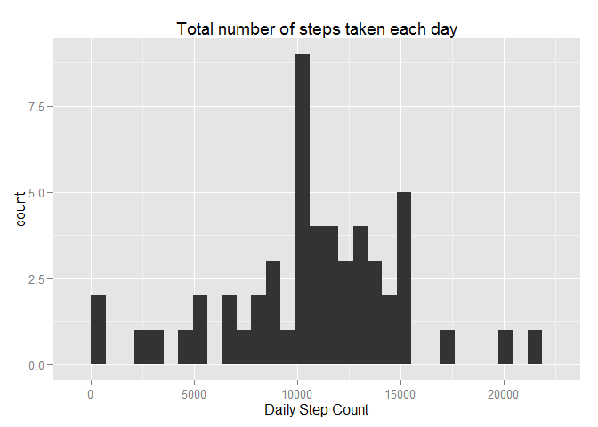
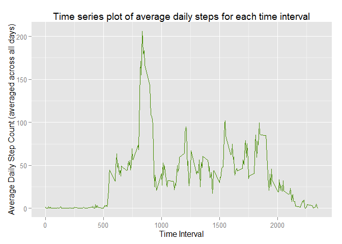
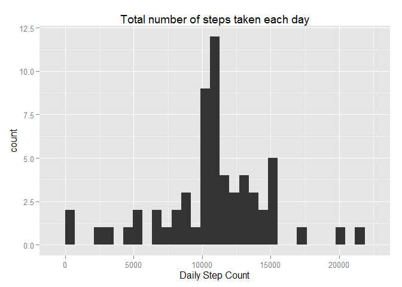
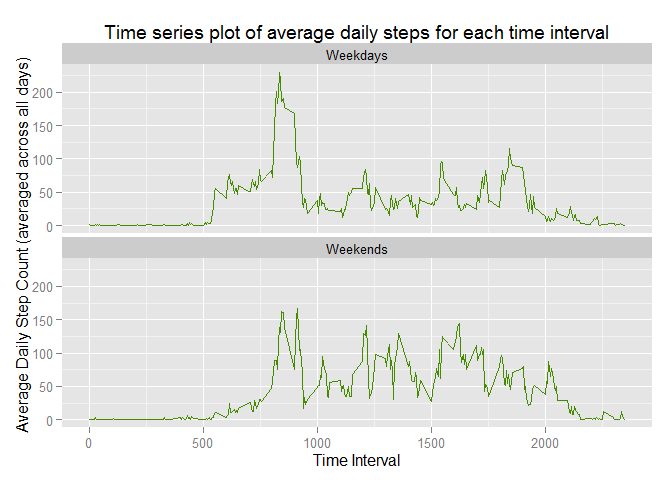

# Reproducible Research: Peer Assessment 1

## Report Details
Coursera Reproducible Research Project 1  
Author: ashreedhar  
   
This report uses data collected about the daily activity of an anonymous individual using a personal fitness tracker over 2 months to answer the following simple questions about the individual's activity patterns:  
1. What is the mean total number of steps taken per day?  
2. What is the average daily activity pattern?  
3. Can missing values be extrapolated, and how does this affect (1) and (2)?  
4. Are there differences in activity patterns between weekdays and weekends?  

## Loading and preprocessing the data
The data will be loaded from [this URL] 
(https://d396qusza40orc.cloudfront.net/repdata%2Fdata%2Factivity.zip)  


```r
if ( !file.exists("activity.csv") ) {
  data_url <- "http://d396qusza40orc.cloudfront.net/repdata%2Fdata%2Factivity.zip"
  download.file(url = data_url, destfile = "rawData.zip")
  unzip(zipfile = "rawData.zip")
}
raw_data <- read.csv(file = "activity.csv")
```


## What is mean total number of steps taken per day?
- Ignore missing values by removing it from the data set for this calculation


```r
library(dplyr)
```

```
## Warning: package 'dplyr' was built under R version 3.2.2
```

```
## 
## Attaching package: 'dplyr'
## 
## The following objects are masked from 'package:stats':
## 
##     filter, lag
## 
## The following objects are masked from 'package:base':
## 
##     intersect, setdiff, setequal, union
```

```r
library(ggplot2)
```

```
## Warning: package 'ggplot2' was built under R version 3.2.2
```

```r
# Clean the data
data1   <- filter(raw_data, !is.na(steps))

# Group data by date and get the total step count for each day
by_date <- group_by(data1, date)
data1   <- summarize(by_date, totalSteps = sum(steps))

# Compute the mean and median daily step counts
meanDailySteps1 <- format(mean(data1$totalSteps), digits=10)
medianDailySteps1 <- format(median(data1$totalSteps), digits=10)

# Plot a histogram of the daily mean step count
ggplot(data=data1, aes(data1$totalSteps)) +
      geom_histogram() + 
      xlab("Daily Step Count") + 
      ggtitle("Total number of steps taken each day")
```

```
## stat_bin: binwidth defaulted to range/30. Use 'binwidth = x' to adjust this.
```

 

- The mean total number of steps taken per day is 10766.18868.  
- The median total number of steps taken per day is 10765.

## What is the average daily activity pattern?


```r
# Clean the data
data2 <- filter(raw_data, !is.na(steps))

# Group data by interval and average across all days
by_interval <- group_by(data2, interval)
data2 <- summarize(by_interval, meanSteps = mean(steps))

# Plot a time series of the average daily steps vs. time interval
ggplot(data2, aes(interval, meanSteps)) + 
      geom_line(color="chartreuse4") + xlab("Time Interval") + 
      ylab("Average Daily Step Count (averaged across all days)") + 
      ggtitle("Time series plot of average daily steps for each time interval")
```

 

```r
# Find the interval with the highest average step count
maxInterval <- data2$interval[which.max(data2$meanSteps)]
```

- The interval with the highest average step count (averaged across all days) is 835.  

## Imputing missing values
- Replace missing step count values with the mean value of step count
for that interval across all days.

```r
clean_data <- raw_data

# Replace NAs with the mean value of step count for that time interval
# averaged across all days
for (x in 1:length(clean_data$steps)) {  
  if ( is.na(clean_data[x,1]) ) { 
    clean_data[x,1] <- data2[match(clean_data[x,3],data2$interval),2] 
  }
} 

# Group data by date and get the total step count for each day
by_date <- group_by(clean_data, date)
data3   <- summarize(by_date, totalSteps = sum(steps))

# Compute the mean and median daily step counts
meanDailySteps3 <- format(mean(data3$totalSteps), digits=10)
medianDailySteps3 <- format(median(data3$totalSteps), digits=10)

# Calculate the difference in mean/median values before, and after replacement
# of missing values
mean_dif <- format( mean(data3$totalSteps) - mean(data1$totalSteps), 10 )
median_dif <- format( median(data3$totalSteps) - median(data1$totalSteps), 10 )

# Plot a histogram of the daily mean step count
ggplot(data=data3, aes(data3$totalSteps)) +
      geom_histogram() + 
      xlab("Daily Step Count") + 
      ggtitle("Total number of steps taken each day")
```

```
## stat_bin: binwidth defaulted to range/30. Use 'binwidth = x' to adjust this.
```

 

- The mean total number of steps taken per day is 10766.18868.  
- The median total number of steps taken per day is 10766.18868.  
  
There is no significant difference between the mean and median values calculated
with and without replacement of missing values:  
- Difference in mean value = 0  
- Difference in median value = 1.188679  

Other replacement policies may yield more significant differences, but it seems
that the activity pattern of this individual is regular enough that the missing
data in this sample causes no material harm to the data analysis.  

## Are there differences in activity patterns between weekdays and weekends?


```r
# Add a column to the dataset indicating if the day is a weekday or weekend
data4 <- mutate(clean_data, weekend = ( grepl("S.*day", weekdays(as.Date(date))) ))

# Group data by interval and average across all days
by_interval_weekend <- group_by(data4, interval, weekend)
data4 <- summarize(by_interval_weekend, meanSteps = mean(steps))
data4 <- mutate(data4, weekend = as.factor(weekend))
levels(data4$weekend) <- c("Weekdays", "Weekends")

# Plot a time series of the average daily steps vs. time interval
ggplot(data4, aes(interval, meanSteps)) + 
      facet_wrap(~weekend, nrow=2) +
      geom_line(color="chartreuse4") + xlab("Time Interval") + 
      ylab("Average Daily Step Count (averaged across all days)") + 
      ggtitle("Time series plot of average daily steps for each time interval")
```

 

A quick glance at the time series plots for activity patterns on weekdays vs. 
weekends shows that weekdays have a higher peak avg. number of steps while 
weekends show a higher general level of activity throughout the day. A guess
at what could cause this would be: the individual goes to the gym on weekdays,
but is sedentary after that. On weekends the individual has a more active 
lifestyle throughout the day because they aren't constrained to a desk.  
